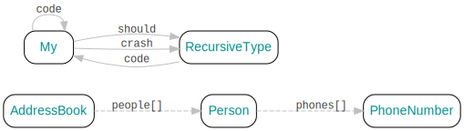

# grpc-visualizer
CLI to visually inspect gRPC's `.proto` config files.
 

(`>>>` indicates a streaming RPC call, `──>` indicates a singular value.)

## Directional Graphs  
Input:  
```proto
message RecursiveType {
    // ...
    My code = 4;
}
message My {
    RecursiveType should = 1;
    // ...
    RecursiveType crash = 3;
    My code = 4;
}
message Person {
    // ...
    message PhoneNumber { /* ... */ }
    repeated PhoneNumber phones = 4;
}
message AddressBook {
    repeated Person people = 1;
}
```
Command: `digraph svg`  
Output:  


## Cyclic Dependency Detection  
### Example 1
Input:  
```proto
message A {
    B aHasB = 1;
    C aAlsoHasC = 2;
}
message B {
    D bHasD = 1;
}
message C {
    D cHasD = 1;
}
message D {
    A dMischievouslyHasA = 1;
}
```
Command: `digraph svg A`  
Output:  


### Example 2
Input:  
```proto
message A {
    B aHasB = 1;
}
message B {
    C bHasC = 1;
    D andD = 2;
    E andE = 3;
}
message C {
    D cAlsoHasD = 1;
}
message D {
    A dMischievouslyHasA = 1;
}
message E {
}
```
Command: `digraph svg`  
Output:  


Command: `digraph svg A`  
Output:  


Command: `digraph svg C`  
Output:  


Command: `digraph svg D`  
Output:  


